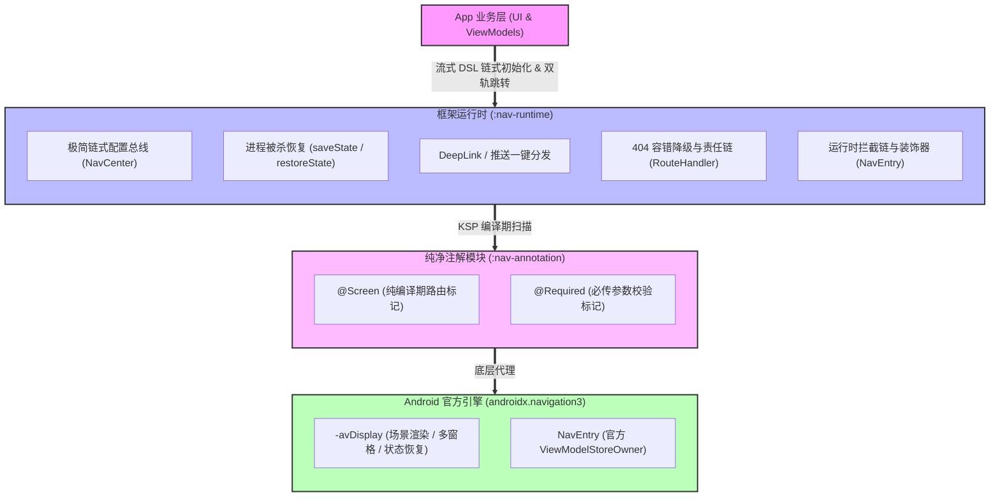

# Nav3-Router 🚀

简体中文 · [English](README_EN.md)

[](https://kotlinlang.org)
[](https://developer.android.com/jetpack/compose)
[](https://kotlinlang.org/docs/ksp-overview.html)
[](LICENSE)

**Nav3-Router** 是一套基于 **Android 官方 Navigation 3 (`androidx.navigation3:1.1.4`)** 状态驱动引擎打造的新一代轻量级、响应式双轨路由与导航框架。

它融合了 **KSP 编译期类型安全** 与 **动态 URL 解耦路由**，内置高级栈控制、声明式解耦拦截链、**进程被杀栈恢复**、**DeepLink/推送一键分发**、**编译期查重与必传参数防御**、**404 容错降级**、**主线程同步安全锁**、**全局/局部双层转场动画**、**原生共享元素形变转场（Shared Element）** 以及 `NavEntryDecorator` 装饰器洋葱皮体系。

---

## 📐 架构设计与物理分层

项目严格遵循高内聚、低耦合的模块化边界划分：



---

## 🌟 核心特性

* **进程被杀状态恢复 (`Process Death Restoration`)**：无缝将导航栈序列化为 URL 列表存入 `Bundle`。当 App 在后台被系统杀死恢复时，一键完整重建整个页面栈，**0 Parcelable 崩溃风险**。
* **DeepLink / 推送解耦分发 (`IntentResolver`)**：统一处理 Scheme 外部唤起、推送通知、桌面小组件与 NFC。支持通过 `IntentResolver` 策略接口自定义复杂的加密推送 Payload 解析。
* **编译期路由查重 (`Route Duplication Check`)**：KSP 编译时自动扫描所有 `@Screen` 路径，若发现重复 route 直接中断构建，从源头上消除了线上静默覆盖隐患。
* **404 容错降级机制 (`Fallback Route`)**：支持配置 `setFallbackRoute("app/not_found")`，当用户误点或下发错误链接时自动平滑降级，绝不白屏崩溃。
* **责任链前置处理 (`RouteHandler`)**：基于责任链模式，可极简扩展 H5 域名白名单检测、外部系统浏览器拉起与自定义 Scheme 拦截。
* **必传参数安全防御 (`@Required`)**：对核心路由参数使用 `@Required` 标记，若跳转时漏传参数会在运行时抛出显式异常，便于快速定位问题。
* **官方 Nav 3 原生对接**：直接代理 `navigation3` 的 `NavDisplay` 与 `NavEntry`，原生享受官方生命周期管理与 ViewModel 自动释放。
* **极简流式 DSL 初始化**：通过 `NavCenter` 链式调用一次性搞定动画配置、拦截器注册、多模块路由加载与首页压栈。
* **零配置多模块架构**：KSP 自动分析子模块包名生成唯一扩展函数（如 `NavCenter.initUser()`），无同名冲突，**0 行 Gradle 配置**。
* **`NavEntryDecorator` 装饰器洋葱皮体系**：原生集成 `rememberViewModelStoreNavEntryDecorator()`，页面出栈自动触发 `onCleared()`。
* **双层转场动画与共享元素形变**：支持全局转场、局部 `@Screen(enterTransition = ...)` 覆写，以及 `.sharedElementKey("key")` 无缝跨页放大型变。

---

## 📌 @Screen 路由命名规范

在 `@Screen(route = "...")` 中，`route` 是页面的全局唯一路径标识符，请严格遵循以下 5 大规范：

| 规范 | 规则说明 | ✅ 正确示例 | ❌ 错误示例 |
| :--- | :--- | :--- | :--- |
| **1. 纯 Path 格式** | 绝不包含 Query 参数（参数由跳转动态拼接） | `@Screen(route = "app/detail")` | `@Screen(route = "app/detail?id={id}")` |
| **2. 模块化双层路径** | 推荐采用 `[module]/[screen]` 避免跨模块冲突 | `@Screen(route = "shop/cart")` | `@Screen(route = "cart")` |
| **3. 开头不带 `/`** | 统一省略开头的斜杠，提高路由表匹配效率 | `@Screen(route = "user/login")` | `@Screen(route = "/user/login")` |
| **4. 全小写蛇形命名** | 遵循标准 URL 协议格式，防止大小写误匹配 | `@Screen(route = "shop/order_detail")` | `@Screen(route = "Shop/OrderDetail")` |
| **5. 全局唯一性** | 同一个 App 内路径必须唯一，重复会触发**编译期报错** | 全局唯一 Path | 多个页面配置相同 route |

---

## 🚀 快速开始

### 1. 添加依赖

框架已发布到 **Maven Central**，在 `build.gradle.kts` 中声明依赖即可：

```kotlin
plugins {
    id("com.google.devtools.ksp") version "2.3.10"
    id("org.jetbrains.kotlin.plugin.serialization") version "2.4.10"
}

dependencies {
    // Nav3-Router 核心
    implementation("io.github.dalingge:nav-annotation:1.0.1")  // 纯注解模块
    implementation("io.github.dalingge:nav-runtime:1.0.1")     // 运行时核心模块
    ksp("io.github.dalingge:nav-compiler:1.0.1")               // KSP 编译器

    // 官方 Navigation 3 生命周期库
    implementation("androidx.lifecycle:lifecycle-viewmodel-navigation3:1.1.4")

    // Kotlinx Serialization
    implementation("org.jetbrains.kotlinx:kotlinx-serialization-json:1.11.0")
}

// 多模块项目需配置模块名，用于生成 NavCenter.initXxx() 扩展函数
ksp {
    arg("NAV_MODULE_NAME", "user")
}
```

### 2. 初始化 (含进程恢复、DeepLink 分发与 404 降级)

在 `MainActivity` 中通过 `NavCenter` 链式 API 完成配置与恢复解耦：

```kotlin
class MainActivity : ComponentActivity() {
    override fun onCreate(savedInstanceState: Bundle?) {
        super.onCreate(savedInstanceState)

        // 1. 流式 DSL 初始化全项配置
        NavCenter
            .init(this)                                                     // 绑定 Context
            .setFallbackRoute("app/not_found")                              // 开启 404 容错降级路由
            .addRouteHandler(WebViewHandler("app/webview", setOf("app.cn")))// H5 白名单走本地 WebView
            .addRouteHandler(BrowserHandler(this))                          // 非白名单 H5 走系统浏览器
            .addEntryDecorator { rememberViewModelStoreNavEntryDecorator() }// 注入官方 ViewModel 作用域隔离
            .addEntryDecorator(AnalyticsEntryDecorator())                   // 注入自定义全埋点与 onPop 清理
            .setDefaultTransition(DefaultSlideTransition())                  // 配置全局转场动画
            .addGlobalInterceptor(AppLoginInterceptor())                    // 注册全局登录拦截器
            .initUser()                                                     // 自动加载 :feature-user 模块路由
            .initShop()                                                     // 自动加载 :feature-shop 模块路由
            .initApp()                                                      // 自动加载 :app 模块路由

        // 2. 解耦恢复逻辑三部曲
        val isRestored = NavCenter.restoreState(savedInstanceState) // A. 尝试从进程被杀状态恢复
        val isIntentHandled = NavCenter.handleIntent(intent)       // B. 尝试从 DeepLink / 推送通知唤起

        // C. 若无进程恢复且无外部唤起，压入根首页
        if (!isRestored && !isIntentHandled && NavCenter.primaryStack.backstack.isEmpty()) {
            NavCenter.navigate(HomeScreenDestination())
        }

        setContent {
            MaterialTheme {
                NavCenter.Render()
            }
        }
    }

    // 3. 响应后台进程被杀前的栈持久化保存
    override fun onSaveInstanceState(outState: Bundle) {
        super.onSaveInstanceState(outState)
        NavCenter.saveState(outState)
    }

    // 4. 响应 singleTop/singleTask 模式下的外部 Scheme / 推送新唤起
    override fun onNewIntent(intent: Intent) {
        super.onNewIntent(intent)
        NavCenter.handleIntent(intent)
    }

    override fun onBackPressed() {
        if (!NavCenter.pop()) {
            super.onBackPressed()
        }
    }
}
```

---

## 💡 核心使用指南

### 1. 进程被杀恢复 (Process Death Restoration) 

当用户将 App 切到后台，系统内存不足杀死进程后，框架会自动将导航栈序列化保存。重新打开 App 时会自动恢复所有页面：

```kotlin
// 1. 在 Activity 销毁前自动持久化当前 Backstack
override fun onSaveInstanceState(outState: Bundle) {
    super.onSaveInstanceState(outState)
    NavCenter.saveState(outState)
}

// 2. 在 onCreate 时一键恢复被杀死前的整个页面栈
val isRestored = NavCenter.restoreState(savedInstanceState)
```

---

### 2. DeepLink & 推送通知一键分发 (`IntentResolver`) 

框架通过 `handleIntent` 自动接管 Scheme 与推送唤起。如果你的推送包含复杂的加密 Payload，可实现 `IntentResolver` 策略接口注入：

```kotlin
// 自定义加密推送 Payload 解析策略
class CustomPushIntentResolver : IntentResolver {
    override fun resolve(intent: Intent?): String? {
        if (intent == null) return null
        
        // 优先解析标准的 Scheme URI (如 myapp://shop/detail?id=10086)
        val schemeUrl = intent.dataString
        if (!schemeUrl.isNullOrEmpty()) return schemeUrl

        // 解密极光/个推等极光推送 Extra 内部的目标链接
        val encryptedData = intent.getStringExtra("PUSH_PAYLOAD") ?: return null
        return decryptPushUrl(encryptedData)
    }
}

// 链式配置注入：
NavCenter.setIntentResolver(CustomPushIntentResolver())

// 触发唤起：
NavCenter.handleIntent(intent)
```

---

### 3. 声明页面、必传参数 `@Required` 与局部转场

```kotlin
@Serializable
data class UserProfile(val id: Int, val name: String)

// 详情页：使用 @Required 标记必传参数，未传时运行时抛出安全异常
@Composable
@Screen(route = "app/detail", needLogin = true)
fun DetailScreen(@Required detailId: Int, user: UserProfile) { ... }

// 弹窗页面：局部覆盖为 BottomSheetTransition 底部滑入动画
@Composable
@Screen(
    route = "app/bottom_dialog",
    enterTransition = BottomSheetTransition::class
)
fun BottomDialogScreen() { ... }
```

---

### 4. 自定义 `RouteInterceptor` 拦截器

实现 `RouteInterceptor` 接口（归属于 `:nav-runtime`），进行极速同步拦截与透明重定向：

```kotlin
class AppLoginInterceptor : RouteInterceptor {
    override fun intercept(url: String): InterceptResult {
        val uri = Uri.parse(url)
        val path = uri.path?.removePrefix("/") ?: uri.schemeSpecificPart
        val meta = NavRegistry.getMeta(path)

        if (meta?.needLogin == true && !UserSession.isLoggedIn) {
            val encodedTarget = URLEncoder.encode(url, "UTF-8")
            return InterceptResult.Redirect("app/login?redirect=$encodedTarget")
        }

        return InterceptResult.Proceed
    }
}
```

---

### 5. 共享元素形变转场 (Shared Element Transitions)

```kotlin
@Composable
@Screen(route = "app/home")
fun HomeScreen() {
    val avatarKey = "user_avatar_10086"

    Row(modifier = Modifier.clickable {
        NavCenter.navigate(DetailScreenDestination(detailId = 1, user = UserProfile(1, "A")))
    }) {
        Image(
            painter = painterResource(R.drawable.avatar),
            contentDescription = null,
            modifier = Modifier
                .size(50.dp)
                .sharedElementKey(key = avatarKey) // 绑定 Shared Key
        )
        Text("点击查看大图")
    }
}
```

---

### 6. 纯 Kotlin 单元测试 (`Navigator`)

```kotlin
class HomeViewModel(private val navigator: Navigator) : ViewModel() {
    fun openDetail(userId: Int) {
        navigator.navigate(DetailScreenDestination(detailId = userId, user = UserProfile(userId, "Aleyn")))
    }
}

// 纯 Kotlin 单元测试 (无需 Android/Robolectric 环境)
@Test
fun testOpenDetail() {
    val fakeNavigator = FakeNavigator()
    val viewModel = HomeViewModel(fakeNavigator)

    viewModel.openDetail(10086)

    assertEquals("app/detail", fakeNavigator.lastDestination?.route)
}
```

---

## 🚀 高级功能

### 1. 跨模块无 UI 服务发现 (`@Service` & `IService`)

为支持大型组件化项目中**无 UI 业务逻辑的解耦调用**（例如 `:feature-shop` 需要调用 `:feature-pay` 模块的支付服务，但两个模块之间不能有直接的 Gradle 依赖），框架提供基于 KSP 自动注册的 **零反射** 服务发现机制。

**A. 在公共基础库中定义服务接口：**

```kotlin
// 在公共基础模块 (:core-common) 中定义接口，需继承 IService
interface PayService : IService {
    fun pay(orderId: String, amount: Double): Boolean
}
```

**B. 在服务实现模块中使用 `@Service` 标注暴露：**

```kotlin
// 在业务实现模块 (:feature-pay) 中实现接口并用 @Service 标注
// contract 指定暴露给外部的接口，path 为可选的字符串路径标识
@Service(contract = PayService::class, path = "pay/service")
class PayServiceImpl : PayService {
    override fun pay(orderId: String, amount: Double): Boolean {
        Log.d("PayService", "正为订单 $orderId 扣款 $amount 元")
        return true
    }
}
```

**C. 在任意业务模块中无耦合获取并调用（KSP 编译期强类型绑定，0 反射）：**

```kotlin
// 方式 1：通过接口 Class 获取（推荐）
val payService = NavCenter.getService<PayService>()
payService?.pay(orderId = "10086", amount = 199.0)

// 方式 2：通过 Path 字符串路径获取
val payServiceByPath = NavCenter.getService<PayService>("pay/service")
payServiceByPath?.pay(orderId = "10086", amount = 199.0)
```

### 2. 动态路径 / URL 重写服务 (`PathReplaceService`)

用于 **A/B 测试**、**在线 URL 动态纠错** 或 **服务端下发路由映射**。在路由发起的最前端对原始 URL 进行规则重写：

**A. 实现 `PathReplaceService` 接口：**

```kotlin
// A/B 测试动态路径替换器
class ABTestPathReplacer : PathReplaceService {
    override fun replace(rawUrl: String): String {
        // 若原始 URL 为 "pay/detail" 且命中 A/B 测试人群，重写为 2.0 版详情页
        if (rawUrl == "pay/detail" && ABTestEngine.isGroupA()) {
            return "pay/detail_v2"
        }
        return rawUrl
    }
}
```

**B. 在 `NavCenter` 链式配置中注册（支持注册多个重写策略链）：**

```kotlin
NavCenter
    .addPathReplaceService(ABTestPathReplacer()) // 支持注册多个重写策略
    .initUser()
    .navigate(HomeScreenDestination())
```

### 3. 绿色通道越过拦截 (`greenChannel = true`)

在紧急救援、高级权限直达或特定业务场景下，如果需要**强制跳过所有全局与私有拦截器 (`RouteInterceptor`)**，可以在跳转时开启 `greenChannel` 选项：

```kotlin
// 强行直达详情页，跳过全局登录拦截器与 VIP 权限拦截器
NavCenter.navigate(DetailScreenDestination(detailId = 100, user = user)) {
    greenChannel = true // 开启绿色通道，免防拦截
}
```

### 4. 全局 Overlay 浮层机制 (`showOverlay` & `dismissOverlay`)

在基于 `NavDisplay` 的导航体系中，标注了 `@Screen` 的页面会被识别为一个全新的路由 Scene。如果希望在**不切换当前路由页面、保持背景当前页完整可见**的前提下，跨模块弹出收银台、全局 Loading、版本更新弹窗等，可以使用全局 Overlay 浮层机制。

**使用场景：**

* **跨模块服务化弹窗**：如在 `:feature-pay` 模块中提供收银台，`:feature-shop` 调用时直接在当前结算页上方滑出弹窗，结算页作为背景完整保留。
* **全局加载/状态弹窗**：全局无视路由页面的浮层提示。
* **全局更新/公告弹窗**：不占用路由 `backstack` 深度，独立于导航栈之外。

**A. 弹出全局 Overlay 浮层：**

```kotlin
// 在 Service 实现类、ViewModel 或任意位置调用，浮层将直接叠加在当前可见页面最上方
NavCenter.showOverlay {
    // 放入任意纯 Compose 弹窗组件 (如 ModalBottomSheet / Dialog)
    PayDialog(
        orderId = "ORDER_10086",
        amount = 199.0,
        onPaySuccess = {
            NavCenter.dismissOverlay() // 关闭浮层
            NavCenter.popWithResult("pay_result", true) // 回传结果
        },
        onDismiss = {
            NavCenter.dismissOverlay() // 关闭浮层
        }
    )
}
```

**B. 关闭全局 Overlay 浮层：**

```kotlin
NavCenter.dismissOverlay()
```

**C. 在 `:feature-pay` 跨模块服务中的优雅运用**（结合 `PayService` 服务发现，实现零 UI 耦合拉起当前页弹窗）：

```kotlin
@Service(contract = PayService::class, path = "pay/service")
class PayServiceImpl : PayService {

    override fun showPayDialog(orderId: String, amount: Double) {
        // 直接在当前活跃页面上方弹出收银台
        NavCenter.showOverlay {
            PayDialog(
                orderId = orderId,
                amount = amount,
                onPaySuccess = {
                    NavCenter.dismissOverlay()
                    NavCenter.popWithResult("pay_result", true)
                },
                onDismiss = {
                    NavCenter.dismissOverlay()
                    NavCenter.popWithResult("pay_result", false)
                }
            )
        }
    }
}
```

---

## 📖 API 速查表

| API | 功能描述 |
| :--- | :--- |
| `NavCenter.init(context)` | 绑定全局上下文 |
| `NavCenter.saveState(bundle)` | 将当前 Backstack 序列化存入 Bundle（应对进程被杀） |
| `NavCenter.restoreState(bundle)` | 从 Bundle 中恢复被杀前的页面栈，返回恢复结果 |
| `NavCenter.handleIntent(intent)` | 一键解析并分发 Scheme / DeepLink / 推送通知跳转 |
| `NavCenter.setIntentResolver(resolver)` | 动态设置自定义 DeepLink / 推送解析策略  |
| `NavCenter.setFallbackRoute(route)` | 配置 404 路由降级兜底路径 |
| `NavCenter.addRouteHandler(handler)` | 注册责任链前置处理器（如 WebViewHandler） |
| `NavCenter.navigate(dest, navOptions)` | 强类型跳转（支持 SingleTop / PopUpTo / ClearTask），支持链式调用 |
| `NavCenter.navigate(url, navOptions)` | URL 动态跳转（自动 URL 编解码 & 参数匹配），支持链式调用 |
| `NavCenter.addEntryDecorator(decorator)` | 动态注入页面 Decorator（如 `rememberViewModelStoreNavEntryDecorator`） |
| `NavCenter.setDefaultTransition(transition)` | 注册全局默认转场动画（如 `DefaultSlideTransition`） |
| `NavCenter.addGlobalInterceptor(interceptor)` | 动态注册运行时拦截器（`RouteInterceptor`） |
| `NavCenter.initXxx()` | 多模块 KSP 自动生成的流式路由初始化扩展函数 |
| `Modifier.sharedElementKey(key)` | 为组件绑定共享元素 Key |
| `NavCenter.pop()` | 栈顶页面出栈（主线程同步，返回值绝对可靠） |
| `NavCenter.popWithResult(key, value)` | 携带结果出栈，同步返回布尔状态 |
| `NavCenter.getResult<T>(key)` | Composable 内部响应式监听回传结果（支持可空 `null` 结果） |
| `NavCenter.Render()` | 官方 Navigation 3 UI 渲染总入口 |
| `NavCenter.getService<T>()` | 跨模块按接口 Class 发现并获取无 UI 服务实例（0 反射） |
| `NavCenter.getService<T>(path)` | 跨模块按 Path 字符串发现并获取服务实例 |
| `NavCenter.addPathReplaceService(service)` | 注册动态路径/URL 重写策略（用于 A/B 测试、动态映射） |
| `NavCenter.navigate(dest) { greenChannel = true }` | 开启绿色通道，跳转时跳过所有拦截器强行直达目标页 |
| `@Service(contract = KClass, path = "")` | 跨模块服务暴露注解，KSP 编译期自动注册服务实现 |
| `NavCenter.showOverlay { content }` | 在当前活跃页面之上叠加任意 Compose 浮层（保持背景当前页可见）  |
| `NavCenter.dismissOverlay()` | 关闭当前全局 Overlay 浮层 |
| `NavCenter.currentOverlay` | 当前浮层的 Composable 状态对象（用于自定义渲染逻辑） |

---


## 📄 License

```text
Copyright 2024 Nav3-Router Open Source Project

Licensed under the Apache License, Version 2.0 (the "License");
you may not use this file except in compliance with the License.
You may obtain a copy of the License at

   http://www.apache.org/licenses/LICENSE-2.0

Unless required by applicable law or agreed to in writing, software
distributed under the License is distributed on an "AS IS" BASIS,
WITHOUT WARRANTIES OR CONDITIONS OF ANY KIND, either express or implied.
See the License for the specific language governing permissions and
limitations under the License.
```
```